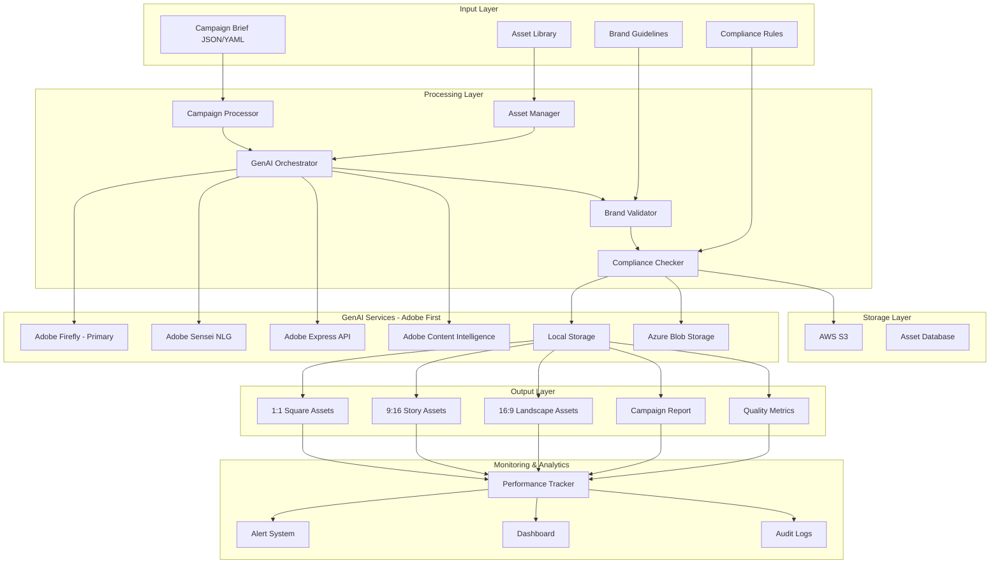

# Creative Automation Pipeline - System Architecture

## High-Level Architecture Overview



## Detailed Component Architecture

### 1. Input Layer

#### Campaign Brief Processor
- **Format**: JSON/YAML structured input
- **Required Fields**: 
  - Product information
  - Target region/market
  - Target audience demographics
  - Campaign message
  - Brand requirements
- **Validation**: Schema validation and completeness checks

#### Asset Library Manager
- **Storage**: Hierarchical asset organization
- **Metadata**: Asset type, dimensions, usage rights
- **Versioning**: Asset version control and history
- **Search**: Content-based asset discovery

### 2. Processing Core

#### Campaign Orchestrator
```python
class CampaignProcessor:
    def __init__(self):
        self.asset_manager = AssetManager()
        self.genai_service = GenAIOrchestrator()
        self.validator = BrandValidator()
        
    def process_campaign(self, brief):
        # 1. Parse and validate brief
        # 2. Identify required assets
        # 3. Check existing asset library
        # 4. Generate missing assets
        # 5. Apply brand validation
        # 6. Create multi-format outputs
```

#### GenAI Integration Layer - Adobe Ecosystem First
- **Adobe Firefly**: Primary image generation service with commercial-safe models
- **Adobe Sensei**: Natural language generation with brand voice consistency
- **Adobe Express**: Template-based creative automation for rapid deployment
- **Adobe Content Intelligence**: Advanced content analysis and optimization
- **Fallback Strategy**: OpenAI services as secondary option
- **Rate Limiting**: Adobe Creative SDK quota management
- **Quality Control**: Adobe-native brand compliance validation

### 3. Brand Compliance Engine

#### Visual Brand Validation
- **Logo Detection**: Computer vision logo placement check
- **Color Palette**: Brand color compliance verification
- **Typography**: Font usage validation
- **Layout Rules**: Composition guideline enforcement

#### Content Compliance
- **Legal Screening**: Prohibited terms detection
- **Cultural Sensitivity**: Regional appropriateness checks
- **Regulatory Compliance**: Industry-specific requirements
- **Accessibility**: WCAG guideline compliance

### 4. Multi-Format Generation Pipeline

#### Aspect Ratio Processing
```python
ASPECT_RATIOS = {
    'square': (1080, 1080),      # Instagram posts
    'story': (1080, 1920),       # Instagram/FB stories
    'landscape': (1920, 1080),   # Facebook posts
    'banner': (1200, 628),       # Facebook link posts
}
```

#### Dynamic Text Overlay
- **Typography System**: Brand-compliant font rendering
- **Layout Engine**: Intelligent text positioning
- **Localization**: Multi-language text rendering
- **Responsive Design**: Text scaling across formats

## Data Flow Architecture

### 1. Ingestion Flow
```
Campaign Brief → Validation → Asset Discovery → Generation Queue
```

### 2. Generation Flow  
```
Brief Analysis → Asset Requirements → GenAI Calls → Quality Check → Format Generation
```

### 3. Validation Flow
```
Generated Assets → Brand Compliance → Legal Check → Approval → Storage
```

### 4. Output Flow
```
Approved Assets → Format Conversion → Metadata Addition → Organized Storage
```

## Integration Points

### External Systems - Adobe Ecosystem Integration
- **Adobe Experience Cloud**: Complete customer journey and campaign orchestration
- **Adobe Creative Cloud**: Native creative asset management and collaboration
- **Adobe Experience Manager**: Enterprise DAM and content lifecycle management
- **Adobe Analytics**: Advanced campaign performance tracking and customer insights
- **Adobe Target**: Personalization and A/B testing for creative optimization
- **Adobe Campaign**: Marketing automation and customer journey management
- **Third-party CRM**: Salesforce, HubSpot integration where needed
- **External Marketing Platforms**: Social media APIs, programmatic advertising

### API Architecture
```yaml
endpoints:
  - POST /campaigns/generate
  - GET /campaigns/{id}/status  
  - GET /campaigns/{id}/assets
  - POST /assets/validate
  - GET /analytics/performance
```

## Scalability Considerations

### Horizontal Scaling
- **Microservices**: Independent service scaling
- **Queue System**: Asynchronous processing
- **Load Balancing**: Request distribution
- **Caching**: Asset and metadata caching

### Performance Optimization
- **Parallel Processing**: Concurrent asset generation
- **Smart Caching**: Reuse of similar assets
- **CDN Integration**: Global asset distribution
- **Database Optimization**: Efficient asset querying

## Security Architecture

### Data Protection
- **Encryption**: At-rest and in-transit encryption
- **Access Control**: Role-based permissions
- **Audit Trail**: Complete action logging
- **Data Retention**: Automated cleanup policies

### API Security
- **Authentication**: OAuth 2.0/JWT tokens
- **Rate Limiting**: API abuse prevention
- **Input Validation**: Injection attack prevention
- **HTTPS Only**: Secure transport layer

## Monitoring & Observability

### Metrics Collection
- **Performance Metrics**: Generation time, success rate
- **Quality Metrics**: Brand compliance scores
- **Usage Metrics**: API calls, asset utilization
- **Error Metrics**: Failure rates, error categorization

### Alerting System
- **Real-time Alerts**: Critical failure notifications
- **Threshold Alerts**: Performance degradation
- **Business Alerts**: Campaign milestone notifications
- **Escalation Rules**: Automated stakeholder notification

This architecture provides a robust, scalable foundation for creative automation while maintaining brand integrity and compliance requirements.