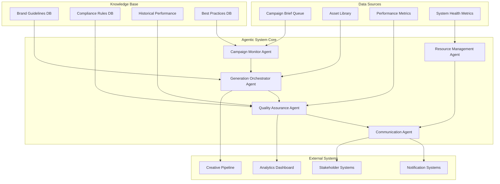

# Agentic System Design for Creative Automation

## Executive Summary

This document outlines the design of an AI-driven agent system that monitors, orchestrates, and optimizes the creative automation pipeline. The system provides intelligent oversight, quality assurance, and stakeholder communication to ensure consistent, high-quality creative output at scale.

## System Architecture

### Core Agent Components



## Agent Specifications

### 1. Campaign Monitor Agent

**Primary Function**: Continuously monitor incoming campaign briefs and trigger appropriate workflows.

**Capabilities**:
- **Brief Analysis**: Parse and validate incoming campaign briefs
- **Priority Assessment**: Determine urgency and resource requirements
- **Workflow Routing**: Route briefs to appropriate generation queues
- **SLA Monitoring**: Track processing times against service level agreements

**Intelligence Model**:
```python
class CampaignMonitorAgent:
    def __init__(self, llm_context):
        self.context = {
            "current_queue_depth": "monitoring_queue_status",
            "resource_availability": "tracking_system_resources",
            "historical_patterns": "analyzing_past_campaigns",
            "priority_matrix": "business_impact_assessment"
        }
    
    def analyze_brief(self, brief):
        """
        Analyze campaign brief and determine processing strategy
        """
        analysis = self.llm_process({
            "brief_content": brief,
            "brand_guidelines": self.context["brand_db"],
            "resource_status": self.context["resources"],
            "historical_performance": self.context["history"]
        })
        
        return {
            "priority_score": analysis.priority,
            "complexity_assessment": analysis.complexity,
            "resource_requirements": analysis.resources_needed,
            "estimated_completion": analysis.timeline,
            "risk_factors": analysis.risks
        }
```

**Monitoring Triggers**:
- New campaign brief submission
- Brief modification or updates
- Missed SLA thresholds
- Resource constraint detection

### 2. Generation Orchestrator Agent

**Primary Function**: Intelligently manage and optimize the creative generation process.

**Capabilities**:
- **Resource Allocation**: Optimize GenAI API usage and system resources
- **Quality Prediction**: Predict generation success probability
- **Batch Optimization**: Group similar requests for efficiency
- **Failover Management**: Handle service outages and errors gracefully

**Decision Framework**:
```yaml
orchestration_rules:
  resource_allocation:
    - if queue_depth > 50: enable_batch_processing
    - if api_quota < 20%: implement_rate_limiting
    - if similar_briefs_detected: enable_template_optimization
  
  quality_optimization:
    - if brand_compliance_risk > 0.3: add_additional_validation
    - if previous_failures > 2: switch_to_conservative_prompts
    - if client_tier == "premium": enable_enhanced_quality_checks
  
  error_handling:
    - if primary_api_fails: switch_to_fallback_service
    - if generation_timeout: retry_with_simpler_prompt
    - if validation_fails: flag_for_human_review
```

**Performance Optimization**:
- **Intelligent Batching**: Group similar requests to reduce API calls
- **Prompt Optimization**: Learn from successful generations to improve prompts
- **Resource Scheduling**: Balance load across time zones and peak hours
- **Cache Management**: Reuse similar assets when appropriate

### 3. Quality Assurance Agent

**Primary Function**: Continuously monitor output quality and identify improvement opportunities.

**Capabilities**:
- **Real-time Quality Scoring**: Assess each generated asset
- **Trend Analysis**: Identify quality degradation patterns
- **Comparative Analysis**: Benchmark against historical performance
- **Predictive Alerts**: Forecast potential quality issues

**Quality Metrics Framework**:
```python
class QualityAssuranceAgent:
    def __init__(self):
        self.quality_metrics = {
            "brand_compliance": {
                "weight": 0.3,
                "threshold": 0.85,
                "trend_window": "7_days"
            },
            "content_appropriateness": {
                "weight": 0.25,
                "threshold": 0.9,
                "trend_window": "24_hours"
            },
            "generation_success_rate": {
                "weight": 0.2,
                "threshold": 0.95,
                "trend_window": "24_hours"
            },
            "stakeholder_satisfaction": {
                "weight": 0.15,
                "threshold": 0.8,
                "trend_window": "30_days"
            },
            "processing_efficiency": {
                "weight": 0.1,
                "threshold": 0.85,
                "trend_window": "7_days"
            }
        }
    
    def assess_quality(self, asset_batch):
        """Comprehensive quality assessment of generated assets"""
        scores = {}
        for metric, config in self.quality_metrics.items():
            scores[metric] = self.calculate_metric_score(asset_batch, metric)
        
        weighted_score = sum(
            scores[metric] * config["weight"] 
            for metric, config in self.quality_metrics.items()
        )
        
        return {
            "overall_quality_score": weighted_score,
            "component_scores": scores,
            "quality_trend": self.analyze_trend(scores),
            "recommendations": self.generate_recommendations(scores)
        }
```

**Alert Conditions**:
- Quality score drops below threshold for 3 consecutive batches
- Brand compliance violations increase by >20% week-over-week
- Generation failure rate exceeds 5% in any 2-hour window
- Asset count falls below minimum requirements for any product

### 4. Resource Management Agent

**Primary Function**: Monitor and optimize system resources, API quotas, and operational costs.

**Capabilities**:
- **API Quota Management**: Track usage across all GenAI services
- **Cost Optimization**: Balance quality vs. cost based on campaign priorities
- **Capacity Planning**: Predict future resource needs
- **Performance Monitoring**: Track system health and bottlenecks

**Resource Monitoring Dashboard**:
```json
{
  "api_quotas": {
    "openai_dalle": {
      "daily_limit": 1000,
      "current_usage": 650,
      "projected_usage": 850,
      "cost_per_call": 0.04,
      "status": "warning"
    },
    "openai_gpt4": {
      "daily_limit": 5000,
      "current_usage": 2100,
      "projected_usage": 3200,
      "cost_per_call": 0.03,
      "status": "good"
    }
  },
  "system_resources": {
    "processing_queue_depth": 23,
    "average_processing_time": "4.2_minutes",
    "success_rate": "94.5%",
    "storage_utilization": "67%"
  },
  "cost_analysis": {
    "daily_spend": 67.50,
    "monthly_projection": 1980.00,
    "cost_per_asset": 2.15,
    "efficiency_trend": "improving"
  }
}
```

### 5. Communication Agent

**Primary Function**: Manage stakeholder communications, alerts, and reporting.

**Model Context Protocol**:
```yaml
communication_context:
  stakeholder_profiles:
    creative_lead:
      communication_style: "detailed_technical"
      notification_preferences: ["quality_issues", "creative_insights"]
      urgency_threshold: "medium"
      preferred_channels: ["email", "slack"]
    
    ad_operations:
      communication_style: "operational_summary"
      notification_preferences: ["sla_violations", "capacity_issues"]
      urgency_threshold: "high"
      preferred_channels: ["sms", "email"]
    
    it_team:
      communication_style: "technical_details"
      notification_preferences: ["system_failures", "security_alerts"]
      urgency_threshold: "critical"
      preferred_channels: ["pagerduty", "slack"]
    
    legal_compliance:
      communication_style: "formal_detailed"
      notification_preferences: ["compliance_violations", "audit_requirements"]
      urgency_threshold: "high"
      preferred_channels: ["email", "formal_report"]

  message_templates:
    quality_alert:
      subject: "Creative Quality Alert - {campaign_name}"
      urgency: "high"
      context_required:
        - quality_metrics
        - affected_assets
        - root_cause_analysis
        - recommended_actions
    
    resource_warning:
      subject: "Resource Capacity Warning - {service_name}"
      urgency: "medium"
      context_required:
        - current_usage
        - projected_usage
        - impact_assessment
        - mitigation_options
    
    compliance_violation:
      subject: "URGENT: Compliance Violation Detected"
      urgency: "critical"
      context_required:
        - violation_details
        - affected_content
        - regulatory_implications
        - immediate_actions_required
```

## Intelligent Monitoring & Alerting

### Campaign Brief Monitoring

**Continuous Monitoring Capabilities**:
- **Brief Queue Analysis**: Monitor submission patterns and identify bottlenecks
- **Content Classification**: Automatically categorize briefs by complexity and requirements
- **Dependency Mapping**: Track asset dependencies and blocking relationships
- **Performance Prediction**: Forecast completion times based on historical data

**Alert Triggers**:
```python
monitoring_rules = {
    "brief_processing": {
        "sla_violation": {
            "condition": "processing_time > sla_threshold * 1.2",
            "severity": "high",
            "stakeholders": ["ad_operations", "creative_lead"],
            "action": "escalate_resources"
        },
        "queue_backup": {
            "condition": "queue_depth > normal_capacity * 2",
            "severity": "medium",
            "stakeholders": ["it_team", "ad_operations"],
            "action": "scale_resources"
        },
        "quality_degradation": {
            "condition": "quality_score < threshold for 3_consecutive_batches",
            "severity": "high",
            "stakeholders": ["creative_lead", "quality_team"],
            "action": "pause_and_investigate"
        }
    }
}
```

### Asset Sufficiency Tracking

**Intelligent Asset Analysis**:
- **Variant Counting**: Track creative variants across all formats and regions
- **Diversity Scoring**: Measure visual and conceptual diversity of generated assets
- **Gap Detection**: Identify missing assets for complete campaign coverage
- **Quality Distribution**: Ensure high-quality assets across all segments

**Sufficiency Criteria**:
```yaml
asset_sufficiency_rules:
  minimum_requirements:
    - variants_per_product: 3
    - formats_required: ["square", "story", "landscape"]
    - quality_threshold: 0.8
    - brand_compliance: 0.9
  
  optimal_requirements:
    - variants_per_product: 5
    - regional_variants: true
    - a_b_test_versions: 2
    - seasonal_adaptations: true
  
  alert_conditions:
    insufficient_variants:
      trigger: "variant_count < minimum_threshold"
      severity: "medium"
      action: "generate_additional_variants"
    
    quality_gap:
      trigger: "high_quality_assets < 60% of total"
      severity: "high"
      action: "regenerate_low_quality_assets"
    
    missing_formats:
      trigger: "required_format_missing for 2+ hours"
      severity: "high"
      action: "prioritize_missing_formats"
```

### Automated Generation Task Triggering

**Smart Workflow Orchestration**:
- **Trigger Conditions**: Multiple conditions can initiate generation workflows
- **Priority Scoring**: Intelligent prioritization based on business impact
- **Resource Optimization**: Balance immediate needs with system capacity
- **Quality Assurance**: Built-in checkpoints throughout the process

**Trigger Framework**:
```python
class AutomatedTriggerSystem:
    def __init__(self):
        self.trigger_conditions = {
            "immediate_triggers": [
                "new_campaign_brief_submitted",
                "critical_asset_missing",
                "compliance_violation_detected"
            ],
            "scheduled_triggers": [
                "daily_quality_review",
                "weekly_performance_optimization",
                "monthly_trend_analysis"
            ],
            "threshold_triggers": [
                "queue_depth_exceeded",
                "quality_score_degraded",
                "api_quota_warning"
            ]
        }
    
    def evaluate_triggers(self, system_state):
        active_triggers = []
        
        for trigger_type, conditions in self.trigger_conditions.items():
            for condition in conditions:
                if self.check_condition(condition, system_state):
                    active_triggers.append({
                        "type": trigger_type,
                        "condition": condition,
                        "priority": self.calculate_priority(condition, system_state),
                        "recommended_action": self.get_recommended_action(condition)
                    })
        
        return sorted(active_triggers, key=lambda x: x["priority"], reverse=True)
```

## Performance Analytics & Learning

### Continuous Improvement Loop

**Learning Mechanisms**:
- **Success Pattern Recognition**: Identify what makes campaigns successful
- **Failure Analysis**: Learn from errors to prevent recurrence
- **A/B Testing**: Systematically test different approaches
- **Feedback Integration**: Incorporate stakeholder feedback into decision-making

**Analytics Framework**:
```python
class PerformanceAnalytics:
    def __init__(self):
        self.metrics_tracking = {
            "generation_metrics": [
                "success_rate", "processing_time", "quality_score",
                "brand_compliance", "cost_per_asset"
            ],
            "business_metrics": [
                "campaign_performance", "stakeholder_satisfaction",
                "time_to_market", "resource_utilization"
            ],
            "operational_metrics": [
                "system_uptime", "error_rates", "scaling_efficiency",
                "maintenance_costs"
            ]
        }
    
    def generate_insights(self, time_period="7_days"):
        insights = {
            "performance_trends": self.analyze_trends(time_period),
            "optimization_opportunities": self.identify_improvements(),
            "risk_factors": self.assess_risks(),
            "recommendations": self.generate_recommendations()
        }
        
        return insights
```

## Integration Points

### External System Connections

**API Integrations**:
- **CRM Systems**: Pull campaign requirements and customer data
- **Asset Management**: Connect with existing DAM systems
- **Marketing Automation**: Push completed assets to campaign tools
- **Analytics Platforms**: Share performance data for broader insights

**Webhook Endpoints**:
```yaml
webhook_endpoints:
  incoming:
    - "/webhooks/campaign-brief-submitted"
    - "/webhooks/asset-approved"
    - "/webhooks/compliance-review-complete"
    - "/webhooks/performance-data-update"
  
  outgoing:
    - "crm-system/campaign-status-update"
    - "marketing-automation/assets-ready"
    - "analytics-platform/performance-metrics"
    - "notification-system/stakeholder-alerts"
```

## Security & Compliance

### Data Protection
- **Encryption**: All data encrypted in transit and at rest
- **Access Control**: Role-based permissions for all system components
- **Audit Logging**: Complete audit trail of all system activities
- **Data Retention**: Automated cleanup of sensitive data per policies

### Compliance Monitoring
- **Real-time Scanning**: Continuous compliance checking of all content
- **Regulatory Updates**: Automatic updates to compliance rules
- **Audit Reporting**: Automated generation of compliance reports
- **Incident Response**: Automated response to compliance violations

This agentic system provides comprehensive oversight and optimization of the creative automation pipeline, ensuring consistent quality, compliance, and performance while reducing manual intervention and improving stakeholder satisfaction.